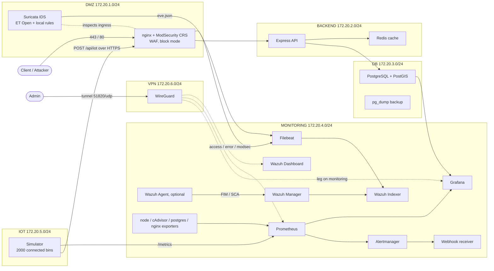

# ECOTRACK

Secure connected-bin waste-management platform: geolocated ingestion of a sensor fleet, real-time monitoring, business KPIs, blocking-mode WAF, network IDS, SIEM, and VPN-restricted administration. The whole stack is declared in a single `docker-compose.yml` with strict network segmentation and static IPAM.

A short, hands-on usage guide is available in `GUIDE.md`.

## Architecture



## Networks

Six static-IPAM bridge networks isolate the data, persistence, monitoring, ingestion, and remote-access planes.

| Network | Range | Plane |
|---|---|---|
| dmz | 172.20.1.0/24 | Public edge: WAF, IDS |
| backend | 172.20.2.0/24 | Application: API, cache |
| db | 172.20.3.0/24 | Persistence: PostgreSQL |
| monitoring | 172.20.4.0/24 | Monitoring and SIEM |
| iot | 172.20.5.0/24 | Sensor ingestion |
| vpn | 172.20.6.0/24 | Remote administration access |

Multi-homing is always an explicit least-privilege decision. The PostgreSQL exporter and Grafana hold a leg on `db` for base reads and mapping. The WAF holds a leg on `iot` to act as the ingestion gateway. The API has no leg on `iot`, so sensor traffic is forced through the WAF and cannot bypass inspection. WireGuard sits in the dedicated `vpn` network with an additional leg on `monitoring` to deliver administrator traffic, and is kept off the `dmz` so the exposed edge has no direct adjacency with the administration plane.

## Data model: connected waste bins

The fleet simulates smart waste bins across 16 Paris zones. Each bin reports a fill level in percent through an ultrasonic sensor, with a progressive growth specific to its zone and category, a collection event when the threshold is reached, and an overflow above 90 percent. Eight categories: general waste GEN, recyclables REC, organic ORG, glass GLA, paper PAP, textile TEX, e-waste EWA, hazardous HAZ. Each bin also reports internal temperature, estimated weight, and sensor battery level.

Bin identifiers encode the category and the zone, for example `GEN-Montmartre-0001`. The value persisted in PostGIS is the fill level, which makes the Grafana map directly usable with bins colored by fill level. Metrics stay low-cardinality, aggregated by category and zone, with the fine-grained identity living in the database.

### Key indicators

**Operational:**

| KPI | Prometheus metric | Reading |
|-----|-------------------|---------|
| Average fill level | `waste_fill_percent_avg{category,zone}` | fleet state |
| Bins to collect at or above 80 percent | `waste_bins_to_collect{category}` | collection load |
| Bins overflowing at or above 90 percent | `waste_bins_overflow{category}` | service incidents |
| Average fill at collection | `waste_fill_at_collection_avg_percent` | routing efficiency, higher is better |
| Collections performed | `waste_collections_total{category,zone}` | activity |
| Overflow events | `waste_overflow_events_total{category}` | service quality |
| Fill rate | `waste_fill_rate_percent_per_hour{category}` | route forecast |
| Fleet utilization | `waste_capacity_utilization_percent` | sizing |

**Environmental:**

| KPI | Metric | Reading |
|-----|--------|---------|
| Diversion rate | `waste_diversion_rate_percent` | share of recoverable waste, REC ORG GLA PAP |
| Collected tonnage | `waste_collected_kg_total{category}` | processed volume |

**Fleet health:**

| KPI | Metric | Reading |
|-----|--------|---------|
| Offline bins | `waste_bins_offline` | telemetry reliability |
| Average sensor battery | `waste_battery_percent_avg` | preventive maintenance |
| Average internal temperature | `waste_bin_temperature_celsius_avg{category}` | fire and odor risk |
| Bins in temperature alert | `waste_bins_temperature_alert` | fire risk |

Useful derived queries: full bins across all categories `sum(waste_bins_to_collect)`; top zones to collect `topk(5, avg by (zone) (waste_fill_percent_avg))`; collection pace `sum(rate(waste_collections_total[1h]))`.

The Grafana dashboard **ECOTRACK - Gestion des déchets** presents these KPIs: diversion and utilization gauges, fill level by zone and category, bins to collect, tonnage, fleet health, and a map of bins colored by fill level.

## Data path

Sensor data enters through the WAF over HTTPS, transits the API which writes to PostgreSQL with PostGIS geolocation and caches the last value in Redis. Application and system metrics flow to Prometheus, which feeds Grafana and triggers Alertmanager. Logs from nginx, ModSecurity, Suricata, PostgreSQL, and WireGuard are collected by Filebeat and indexed in Wazuh, where correlation rules produce high and critical alerts.

## Security

- **Sensor flow encryption** : the fleet posts over HTTPS to the WAF, which terminates TLS and inspects the traffic through ModSecurity before relaying to the API. The API has no leg on the `iot` network, so every sensor POST is forced through the gateway and direct bypass is impossible.
- **WAF** ModSecurity with the OWASP CRS in blocking mode, plus custom rules: SQL injection on `/api`, scanner User-Agents, both returning 403.
- **IDS** Suricata as a sidecar on the WAF ingress, Emerging Threats Open ruleset combined with local rules, more than 50000 active rules.
- **SIEM** Wazuh indexer, manager, and dashboard over TLS, multi-source correlation, SCA disabled to reduce noise.
- **Network segmentation** : the monitoring plane is unreachable from the API, and the database is never exposed.
- **VPN-only administration** : no admin interface is published on the host. Only the WAF on 80 and 443 and WireGuard on 51820/udp are exposed. Consoles are reachable only through the tunnel, by internal IP.

> North-South `iptables`/`DOCKER-USER` filtering is not implemented under Docker Desktop/WSL2, since the chain is not persistent across VM restarts and not testable from the host. The reduced-exposure objective is met by removing port publications and by the VPN. On a native Linux host, a persistent `DOCKER-USER` script with a DROP policy and 443/tcp and 51820/udp exceptions completes the setup.

Suricata runs in IDS mode. Inline blocking is not available under Docker Desktop/WSL2, since the probe is not in-path and NFQUEUE is not reliable. Prevention is enforced at layer 7 by ModSecurity in blocking mode, which is in-path and returns 403. On a native Linux host, Suricata switches to IPS over NFQUEUE without changing the rule logic.

## SIEM collection: two configurations

Filebeat is present in both cases. The mode is chosen at startup.

**Configuration A, agentless, default.** The Wazuh manager reads the WAF, ModSecurity, and Suricata logs directly through mounted volumes and `localfile`, and applies its correlation rules. Filebeat archives raw logs into the indexer in parallel. No agent to deploy.

```powershell
docker compose up -d
```

**Configuration B, with a Wazuh agent.** An official `wazuh/wazuh-agent:4.14.5` agent enrolls with the manager. It adds what the agentless mode does not cover: file integrity monitoring on the security rules, active response readiness, and configuration assessment. The manager and Filebeat are unchanged, and the agent does not re-collect the same logs, which avoids duplicate alerts.

```powershell
docker compose -f docker-compose.yml -f docker-compose.agent.yml up -d
```

The agent then appears in the Wazuh console under Agents. Its FIM detects any change to the read-only files mounted under `/etc/ecotrack-config`: ModSecurity rules, nginx configuration, Suricata rules. If enrollment fails, the manager may require a registration password through `WAZUH_REGISTRATION_PASSWORD`.

## Dynamic anomaly detection

Beyond static thresholds, the Prometheus rule group `ecotrack.iot_anomalies` detects deviations from the fleet recent behavior without a fixed threshold.

- `IoTValeurDeviationAnormale` : a category average fill deviates by more than three standard deviations from its 30-minute moving average.
- `IoTChuteDebitIngestion` : a category ingestion rate drops below 40 percent of its hourly moving average.
- `IoTAffluxAnomaliesAnormal` : an anomaly rate exceeds three times its hourly moving average.

These alerts surface in Prometheus at `http://172.20.4.40:9090/alerts` and are routed by Alertmanager.

## Alert notifications

Alertmanager routes alerts to a webhook receiver, readable through `docker logs ecotrack-webhook-logger`. To notify Slack or Discord, set the URL in `alertmanager/alertmanager.yml` under the `chat` receiver and switch `route.receiver`. For Discord, append `/slack` to the webhook URL.

## PostgreSQL backup

The `postgres-backup` service runs a compressed `pg_dump` at a regular interval through `BACKUP_INTERVAL`, default 3600 seconds, into the `postgres_backups` volume, with rotation through `BACKUP_KEEP`, default 24 dumps.

```powershell
docker exec ecotrack-postgres-backup sh -c "ls -lh /backups"            # list
docker exec -i ecotrack-postgres sh -c "zcat | psql -U ecotrack -d ecotrack" < dump.sql   # restore
```

For a quick demo, lower the interval with `BACKUP_INTERVAL: "60"`.

## Continuous integration

The `.github/workflows/ci.yml` workflow validates every push and pull request to `main` and `master`.

- **Secret-leak guard**, blocking: fails if a sensitive file is tracked by Git, such as `*.pem`, `*-key.pem`, `peer1.conf`, `*.key`, `.env`, `node_modules/`.
- **Compose lint** : `docker compose config` on the base file and the TLS override.
- **YAML/JSON validation** : every configuration file must parse.
- **Trivy IaC** : infrastructure misconfiguration scan.
- **Trivy secrets**, blocking: hardcoded-secret scan.
- **Trivy images** : vulnerability scan of key images, informational.

## Install and run

Host preparation on Windows with Docker Desktop and WSL2, once, in an **administrator PowerShell** :

```powershell
powershell -ExecutionPolicy Bypass -File .\prepare-host.ps1
```

This registers `ecotrack.local`, installs the local mkcert certificate authority, and generates the WAF certificate in `.\certs\`. Start the stack:

```powershell
# 1. Wazuh TLS certificates, once
docker compose --profile setup run --rm wazuh-certs-generator
docker run --rm -v "${PWD}/wazuh-certs:/certs" alpine sh -c "chmod 644 /certs/*.pem; chown -R 1000:1000 /certs"

# 2. Start with the WAF TLS override
docker compose -f docker-compose.yml -f docker-compose.tls.yml up -d
```

To revert host changes at the end of the project: `powershell -ExecutionPolicy Bypass -File .\cleanup-host.ps1`.

## Access

| Interface | Access | Address | Credentials |
|---|---|---|---|
| Application | Public | https://ecotrack.local | — |
| Live bin dashboard | Public | https://ecotrack.local/dashboard | — |
| Grafana, waste KPIs | VPN | http://172.20.4.50:3000 | admin / ecotrack_grafana_pwd |
| Wazuh, SOC console | VPN | https://172.20.4.30:5601 | admin / SecretPassword |
| Prometheus | VPN | http://172.20.4.40:9090 | — |
| Alertmanager | VPN | http://172.20.4.60:9093 | — |
| cAdvisor | VPN | http://172.20.4.80:8080 | — |

The credentials above are demonstration values and must be changed in production.

### Administration access over WireGuard

Admin interfaces respond only while the tunnel is up. On the Windows client, the configuration derives from `peer1.conf` with three adjustments: remove `ListenPort` from the `[Interface]` block, set `Endpoint` to the WSL gateway `172.26.0.1:51820`, add `PersistentKeepalive = 25`.

VPN troubleshooting:

- **Container stopped** : `docker ps --filter name=ecotrack-wireguard` must show `Up` and `0.0.0.0:51820->51820/udp`.
- **Port 51820 reserved by Windows**, shown as an `access permissions` error at container start. Hyper-V or WSL may reserve the port after a reboot. In an administrator PowerShell: `net stop winnat` then `net start winnat`, then restart the container. Inspect reserved ranges with `netsh int ipv4 show excludedportrange protocol=udp`.
- **No handshake** : `docker exec ecotrack-wireguard wg show`, then compare client and server keys. After a `--force-recreate`, confirm the interface public key matches the client `[Peer]`.
- **Endpoint** : the WSL gateway IP can change; recheck with `Get-NetIPAddress -AddressFamily IPv4 | ? InterfaceAlias -match "WSL|vEthernet"`.

## Validation and tests

Fleet and ingestion state, the counter must grow:

```powershell
docker exec ecotrack-postgres psql -U ecotrack -d ecotrack -tAc "SELECT count(*) FROM iot_readings WHERE recorded_at > NOW() - INTERVAL '2 minutes'"
```

SQL injection test, the response must be 403:

```powershell
curl.exe -sk "https://ecotrack.local/api/iot?id=1%27%20OR%20%271%27=%271" -o NUL -w "code=%{http_code}`n"
```

WAF block check, the counter must grow after the attack:

```powershell
docker exec ecotrack-nginx-waf sh -c "grep -c 9000001 /var/log/nginx/modsec_audit.log"
```

Wazuh correlation check, after about fifteen seconds:

```powershell
docker exec ecotrack-wazuh-manager sh -c "grep -E '100112|100114|100115' /var/ossec/logs/alerts/alerts.json | tail -3"
```

Suricata detection check, the number must be greater than zero:

```powershell
docker exec ecotrack-suricata sh -c "grep -c 'event_type.:.alert' /var/log/suricata/eve.json"
```

Full campaign, tunnel active, about ten to fifteen minutes. It checks the stack end to end and runs an offensive phase with nmap, wafw00f, nikto, and sqlmap, correlating attacks with ModSecurity blocks and Suricata and Wazuh alerts:

```powershell
powershell -ExecutionPolicy Bypass -File .\test-ecotrack.ps1
```

## SOC dashboard

Wazuh ships the MITRE ATT&CK mapping under Threat Intelligence. The guide `wazuh-dashboard/SOC-DASHBOARD.md` details how to build a dedicated SOC dashboard with critical alerts, top attackers, timeline, and MITRE techniques, with ready-to-use DQL queries.

## Repository files

| File | Role |
|---|---|
| `docker-compose.yml` | Main composition |
| `docker-compose.tls.yml` | TLS override, local WAF certificate |
| `docker-compose.agent.yml` | Wazuh agent override |
| `prepare-host.ps1` / `cleanup-host.ps1` | Host preparation and revert |
| `test-ecotrack.ps1` | Validation and offensive test campaign |
| `GUIDE.md` | Simple usage guide, in French |
| `wazuh-dashboard/SOC-DASHBOARD.md` | SOC dashboard build guide |