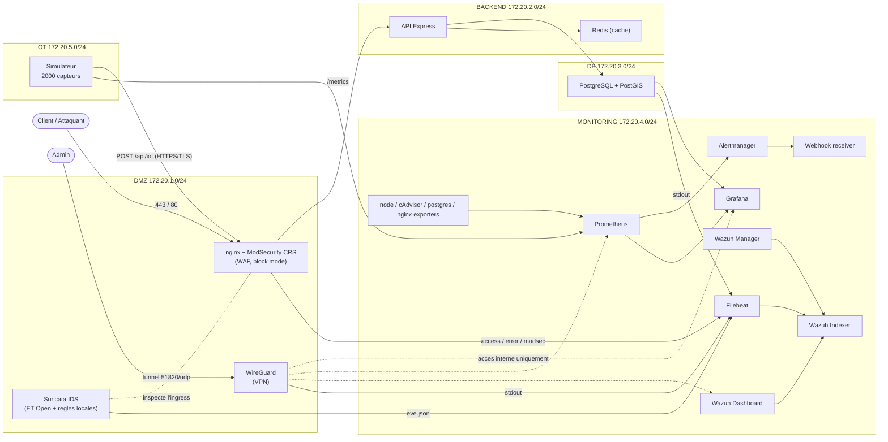

# ECOTRACK

Plateforme IoT urbaine sécurisée : ingestion géolocalisée d'une flotte de capteurs, supervision temps réel, WAF en mode blocage, IDS/IPS, SIEM et accès d'administration restreint par VPN. L'ensemble est décrit dans un unique `docker-compose.yml` (segmentation réseau stricte, IPAM statique).

## Architecture



## Réseaux (5 bridges, IPAM statique)

| Réseau | Plage | Rôle |
|---|---|---|
| dmz | 172.20.1.0/24 | Exposition publique (WAF, VPN) |
| backend | 172.20.2.0/24 | API et cache, non exposés |
| db | 172.20.3.0/24 | PostgreSQL/PostGIS isolé |
| monitoring | 172.20.4.0/24 | Supervision, SIEM, exporters |
| iot | 172.20.5.0/24 | Flotte de capteurs |

## Chaîne de traitement

La donnée capteur entre par le WAF (443/80), traverse l'API qui l'écrit dans PostgreSQL (PostGIS, géolocalisée) et met en cache la dernière valeur dans Redis. Les métriques applicatives et système remontent vers Prometheus, qui alimente Grafana et déclenche Alertmanager. Tous les journaux (nginx, ModSecurity, Suricata, PostgreSQL, WireGuard) sont collectés par Filebeat et indexés dans Wazuh, où des règles de corrélation produisent des alertes de sévérité haute et critique.

## Sécurité

- **Chiffrement du flux capteurs** : la flotte poste en **HTTPS/TLS** vers le WAF (terminaison TLS), qui inspecte le trafic via ModSecurity avant relai a l'API. L'API n'a aucune patte sur le segment `iot` : tout POST capteur est force par la passerelle, le contournement direct est impossible.
- **WAF** ModSecurity (OWASP CRS) en mode blocage + règles custom (SQLi sur `/api`, User-Agents de scanners) → réponses 403.
- **IDS** Suricata en sidecar sur l'ingress du WAF, ruleset Emerging Threats Open (plus de 50 000 règles) combiné aux règles locales.
- **SIEM** Wazuh (indexer/manager/dashboard) en TLS, corrélation multi-sources, SCA désactivé pour réduire le bruit.
- **Segmentation** réseau stricte : le réseau monitoring est inatteignable depuis l'API ; la base n'est jamais exposée.
- **Accès d'administration VPN-only** : aucune interface d'admin n'est publiée sur l'hôte. Seuls le WAF (80/443) et WireGuard (51820/udp) sont exposés. Les UIs (Grafana, Prometheus, Alertmanager, Wazuh) ne sont joignables qu'à travers le tunnel, par IP interne.

> Filtrage Nord-Sud `iptables`/`DOCKER-USER` : non implémenté sous Docker Desktop/WSL2 (chaîne non persistante au redémarrage de la VM et non testable depuis l'hôte). L'objectif d'exposition réduite (uniquement 443 et 51820) est atteint par le retrait des publications de ports et le VPN. En production sur hôte Linux, le script `DOCKER-USER` (politique DROP + exceptions 443/tcp, 51820/udp) rendu persistant via `iptables-persistent` complète le dispositif.

## Démarrage

```powershell
# 1. Certificats TLS Wazuh (une fois)
docker compose --profile setup run --rm wazuh-certs-generator
docker run --rm -v "${PWD}/wazuh-certs:/certs" alpine sh -c "chmod 644 /certs/*.pem; chown -R 1000:1000 /certs"

# 2. Démarrage de la stack
docker compose up -d
```

## Accès

| Interface | Accès | Identifiants |
|---|---|---|
| Application (WAF) | https://ecotrack.local / http://localhost | — |
| Dashboard live IoT | http://localhost/dashboard | — |
| Grafana | http://172.20.4.50:3000 (VPN) | admin / ecotrack_grafana_pwd |
| Prometheus | http://172.20.4.40:9090 (VPN) | — |
| Alertmanager | http://172.20.4.60:9093 (VPN) | — |
| Wazuh Dashboard | https://172.20.4.30:5601 (VPN) | admin / SecretPassword |

L'accès aux interfaces d'administration requiert le tunnel WireGuard actif (voir `peer1.conf`, endpoint sur la passerelle WSL).

## Notifications d'alerte

Alertmanager route les alertes vers un récepteur webhook (`webhook-logger`) dont la sortie est consultable via `docker logs ecotrack-webhook-logger`. Pour notifier Slack ou Discord, renseigner l'URL dans `alertmanager/alertmanager.yml` (receiver `chat`) et basculer `route.receiver` ; pour Discord, ajouter le suffixe `/slack` à l'URL du webhook.

## Certificat TLS local (mkcert)

Pour servir le WAF sur `https://ecotrack.local` sans avertissement navigateur, generer un certificat de confiance local avec mkcert (cote hote Windows) :

```powershell
mkcert -install
mkcert ecotrack.local
# place ecotrack.local.pem et ecotrack.local-key.pem dans .\certs\
```

Ajouter l'entree hosts (PowerShell admin) :

```powershell
Add-Content C:\Windows\System32\drivers\etc\hosts "127.0.0.1 ecotrack.local"
```

Demarrer la stack avec l'override TLS (qui monte le certificat dans le WAF) :

```powershell
docker compose -f docker-compose.yml -f docker-compose.tls.yml up -d nginx-waf
```

La cle privee (`certs/*.pem`) est exclue du depot par `.gitignore`.

## Sauvegarde PostgreSQL

Le service `postgres-backup` realise un `pg_dump` compresse a intervalle regulier (`BACKUP_INTERVAL`, defaut 3600s) dans le volume `postgres_backups`, avec rotation (`BACKUP_KEEP`, defaut 24 dumps).

```powershell
# lister les sauvegardes
docker exec ecotrack-postgres-backup sh -c "ls -lh /backups"
# restaurer une sauvegarde
docker exec -i ecotrack-postgres sh -c "zcat | psql -U ecotrack -d ecotrack" < dump.sql
```

Pour une demo rapide, reduire l'intervalle : `BACKUP_INTERVAL: "60"`.

## Tableau de bord SOC

Wazuh integre nativement le mapping MITRE ATT&CK (menu Threat Intelligence). Le guide `wazuh-dashboard/SOC-DASHBOARD.md` detaille la construction d'un dashboard SOC dedie (alertes critiques, top attaquants, timeline, techniques MITRE) avec les requetes DQL pretes a l'emploi.

## Detection d'anomalies dynamique

En complement des seuils statiques (`iot_anomalies_total`), le groupe d'alertes `ecotrack.iot_anomalies` detecte les ecarts par rapport au comportement recent de la flotte, sans seuil fixe :

- `IoTValeurDeviationAnormale` : la valeur moyenne d'un type s'ecarte de plus de 3 ecarts-types de sa moyenne mobile sur 30 minutes (z-score).
- `IoTChuteDebitIngestion` : le debit d'ingestion d'un type chute sous 40% de sa moyenne mobile horaire (capteurs muets).
- `IoTAffluxAnomaliesAnormal` : le taux d'anomalies d'un type depasse 3x sa moyenne mobile horaire (evenement ou injection de fausses mesures).

Ces alertes remontent dans Prometheus (`http://172.20.4.40:9090/alerts`) et sont routees par Alertmanager comme les autres.

## Integration continue (CI/CD)

Le workflow `.github/workflows/ci-securite` valide chaque push et pull request vers `main` :

- **Anti-fuite de secrets** (bloquant) : echec si un fichier sensible est suivi par Git (`*.pem`, `*-key.pem`, `peer1.conf`, `*.key`, `.env`, `node_modules/`).
- **Lint de la composition** : `docker compose config` sur la base et sur la surcharge TLS.
- **Validation YAML/JSON** : tous les fichiers de configuration doivent parser.
- **Trivy IaC** : detection des mauvaises configurations d'infrastructure.
- **Trivy secrets** (bloquant) : detection de secrets en clair dans le depot.
- **Trivy images** : scan de vulnerabilites des images cles (informatif).

## Tests

```powershell
powershell -ExecutionPolicy Bypass -File .\test-ecotrack.ps1
```

Le script vérifie la stack de bout en bout (conteneurs, routage WAF, plan de données, segmentation, supervision, SIEM, KPI) et lance une phase offensive avec de vrais outils (nmap, wafw00f, nikto, sqlmap) en corrélant les attaques avec le blocage ModSecurity et les alertes Suricata/Wazuh.